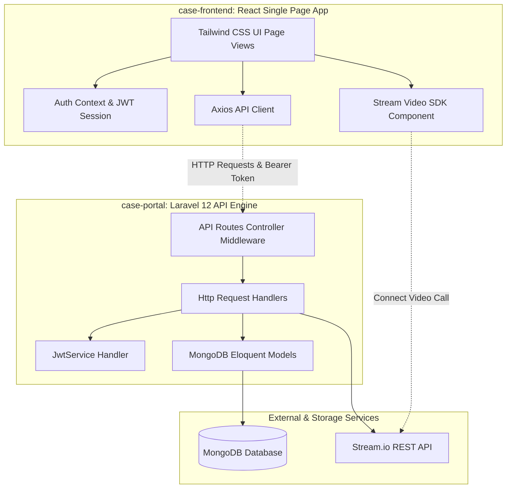
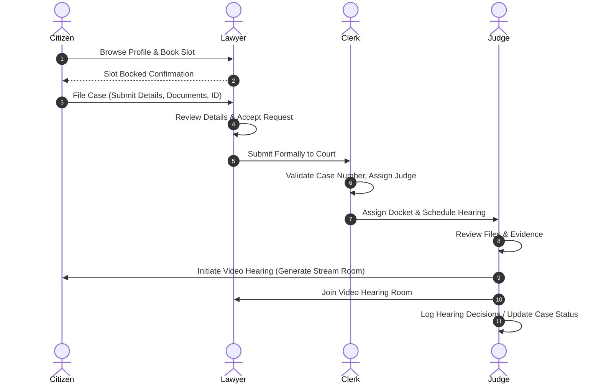

# 🏛️ e-Court: Digital Case Management & Virtual Hearings Portal

[](https://laravel.com)
[](https://reactjs.org)
[](https://tailwindcss.com)
[](https://www.mongodb.com)
[](https://www.php.net)
[](https://jwt.io)
[](https://getstream.io)

A comprehensive, state-of-the-art digital court administration and virtual hearing portal designed to bridge the gap between **citizens**, **lawyers (advocates)**, **judges**, and **court clerks/administrators**. 

This system integrates end-to-end case tracking, secure digital file and evidence uploads, direct communication via a built-in messaging platform, structured legal blogging, and live virtual video court hearings powered by **Stream Video SDK**.

---

## 🌟 Key Features

### 👤 Citizen / Public User Portal
* **Find Legal Representation:** Browse a directory of registered lawyers filtered by jurisdiction (Delhi, Mumbai, Bengaluru, etc.) and category specializations (Cyber Crime, Family Law, Property Disputes, etc.).
* **Instant Consultation Booking:** Schedule and book available appointment slots for initial case review.
* **Online Case Filing:** File a case digitally by entering incident details, listing accused parties and witnesses, detailing relief requested, and uploading ID proof and evidence.
* **Live Status Tracking:** Real-time updates on active cases, upcoming hearings, and court assignments.
* **Direct Lawyer Chat:** Secure real-time messaging with assigned advocates to coordinate legal strategies.

### 💼 Advocate (Lawyer) Interface
* **Docket Management:** Accept, reject, or manage incoming case consultation requests from public users.
* **Case Portfolio:** Track active litigation dockets, client files, and scheduled court dates.
* **Document Depository:** Securely upload and store case-related files, motions, and evidence.
* **Legal Resource Publishing:** Write and publish legal articles, case study blogs, and legislative commentary to build professional reputation.

### 👨‍⚖️ Judge Dashboard
* **Court Roster:** Overview of assigned active dockets, priority cases, and next hearing schedules.
* **Matter Resolution:** Update case status (e.g., Pending, Under Review, Hearing Scheduled, Resolved).
* **Virtual Hearings Room:** Initiate and host secure, latency-free virtual court hearings directly within the portal via Stream SDK.
* **Legal Document & Evidence Review:** View client identity documents and submitted digital evidence packages from the bench.
* **Judicial Profile:** Showcase judicial highlights, qualifications, court division division (chambers), and court schedules.

### 📋 Clerk & Admin Administration Panel
* **Case Registrations:** Process and verify initial digital case filings.
* **Hearing Scheduler:** Coordinate, schedule, and update courtroom dates, assign judges, and allocate hearings.
* **Notifications Engine:** Automated platform alerts for status updates, upcoming hearings, and document requests.
* **Portal Analytics:** Advanced report dashboard displaying total active matters, resolved percentages, case category distributions, and bench activity metrics.

---

## 📐 System Architecture

### Component Diagram



### Case & Appointment Workflow



---

## 📁 Repository Structure

The workspace is organized into two primary projects: a React Single Page Application (SPA) client and a Laravel 12 API server.

```
case-portal/                    # Root workspace directory
├── case-frontend/              # React SPA (Client App)
│   ├── public/                 # Static assets & public images
│   ├── src/                    # React source files
│   │   ├── pages/              # Page components (Dashboard, Blog, CreateCase, etc.)
│   │   │   ├── Login.js        # Citizen, Lawyer, Judge login portal
│   │   │   ├── Signup.js       # Register a new citizen account
│   │   │   ├── Dashboard.js    # Adaptive user-role specific dashboard
│   │   │   ├── CreateCase.js   # Intake form for booking & filing cases
│   │   │   ├── JudgePanel.js   # Case roster & hearing management for Judges
│   │   │   ├── Blog.js         # Legal blogs feed, edit and write controls
│   │   │   └── ProfileSettings.js # Profile management and profile photo uploads
│   │   ├── services/           # Api client, Auth storage, Stream config
│   │   │   ├── api.js          # Global Axios instance with interceptors
│   │   │   ├── auth.js         # Token, Session, and Role routing helpers
│   │   │   └── streamVideo.js  # Stream video client setup
│   │   ├── App.js              # Application routes & middleware protection
│   │   └── index.js            # Frontend entry point
│   ├── package.json            # NPM dependencies & scripts
│   └── tailwind.config.js      # Styling design tokens configuration
│
└── case-portal/                # Laravel 12 REST API Server (Backend App)
    ├── app/                    # Laravel Application Core
    │   ├── Console/            # Custom artisan commands
    │   │   └── Commands/
    │   │       ├── SeedCourtDirectory.php  # Seed default lawyers and judges
    │   │       └── EnsurePrimaryJudge.php  # Configure default judge login & roster
    │   ├── Http/               # Controllers, Middleware, Request handlers
    │   │   ├── Controllers/    # Auth, Case, Hearing, Message, Blog, and Video Controllers
    │   │   └── Middleware/     # JWT Authenticate, Role Authorization
    │   ├── Models/             # MongoDB-mapped Eloquent models
    │   │   ├── User.php        # Users authentication model
    │   │   ├── CourtCase.php   # Court cases & intake details
    │   │   ├── Hearing.php     # Scheduled video and courtroom hearings
    │   │   ├── BlogPost.php    # Legal articles and documents
    │   │   └── Message.php     # Client-advocate chats
    │   └── Services/           # Shared business logic
    │       └── JwtService.php  # Handles JWT encoding, decoding & token verification
    ├── bootstrap/              # Bootstrap routing, providers, and middleware lists
    ├── config/                 # Service & module configuration parameters
    ├── database/               # Database migrations, seeders, and factories
    │   └── seeders/            # Database seed logic (Blogs, Users, Roster)
    ├── routes/                 # Endpoint definitions (api.php, web.php)
    ├── composer.json           # Composer PHP package definitions
    └── package.json            # Vite assets config (Tailwind CSS v4 compiler)
```

---

## 🛠️ Technology Stack

* **Frontend Framework:** React (v19.x) with React Router (v7.x)
* **Backend Framework:** Laravel (v12.x) API Server
* **Database engine:** MongoDB (configured with `mongodb/laravel-mongodb` Eloquent wrapper)
* **Authentication:** Stateless JSON Web Token (JWT) using `firebase/php-jwt`
* **Real-time Video:** Stream.io Video SDK for React
* **Styling & UI:** Tailwind CSS (v3 in client, v4 in backend package manager) & Lucide Icons
* **Dev Server Orchestration:** Concurrently (Vite + Artisan Servers in backend)

---

## 🚀 Setup & Installation

Follow these steps to configure both the backend server and frontend client locally on your machine.

### Prerequisites
* **PHP** >= 8.2 with MongoDB extension installed
* **Composer** (PHP Package Manager)
* **Node.js** >= 18 & **npm**
* **MongoDB Instance** (Local MongoDB Community Server or MongoDB Atlas Cloud instance)

---

### Step 1: Setup the Backend (Laravel 12 API)

1. Open your terminal and navigate to the backend directory:
   ```bash
   cd case-portal
   ```

2. Install PHP dependencies:
   ```bash
   composer install
   ```

3. Create the environment configuration file:
   ```bash
   cp .env.example .env
   ```

4. Generate the application cipher key:
   ```bash
   php artisan key:generate
   ```

5. Configure database and external API integrations in your `.env` file:
   ```env
   # Database connection setting (MongoDB Atlas DSN is recommended)
   DB_CONNECTION=mongodb
   DB_URI=your_mongodb_connection_uri

   # Stream.io keys for virtual video hearings
   STREAM_API_KEY=your_stream_api_key
   STREAM_API_SECRET=your_stream_api_secret

   # Demo Judge credentials
   PRIMARY_JUDGE_EMAIL=judge123@gmail.com
   PRIMARY_JUDGE_PASSWORD=Abhi5bar@
   ```

6. Seed the MongoDB database collections:
   ```bash
   # Seed default blogs/legal resources
   php artisan db:seed --class=BlogSeeder

   # Seed sample lawyers and judges directory
   php artisan app:seed-court-directory

   # Create the primary Judge login profile (Justice Sunderlal Tripathi)
   php artisan ecourt:ensure-primary-judge --reassign-docket
   ```

7. Install node dependencies and compile backend components:
   ```bash
   npm install
   npm run build
   ```

8. Start the backend development servers:
   ```bash
   # Runs Laravel Artisan, Queue worker, Vite asset builder and Pail log logger concurrently
   composer dev
   ```
   *The API server will run at `http://127.0.0.1:8000`.*

---

### Step 2: Setup the Frontend (React Client)

1. Open a new terminal window and navigate to the frontend directory:
   ```bash
   cd case-frontend
   ```

2. Install Node package dependencies:
   ```bash
   npm install
   ```

3. Start the React development server:
   ```bash
   npm start
   ```
   *The frontend client will open automatically in your browser at `http://localhost:3000`.*

---

## 🔑 Demo Access Profiles

You can log in to the portal using these pre-seeded accounts to explore the various system interfaces:

| Profile Role | Email / Username | Password | Notes |
| :--- | :--- | :--- | :--- |
| **Judge (Primary)** | `judge123@gmail.com` | `Abhi5bar@` | Roster profile for *Justice Sunderlal Tripathi*. Can start video hearings. |
| **Lawyer (Cyber Law)** | `riya.sharma@example.com` | *(Register / Use user login)* | Specializes in Criminal Defense and Cyber Crimes. |
| **Citizen (Public)** | *(Create via Signup page)* | *(Custom)* | Access slot bookings, lawyer profile, case submission form. |

---

## 📡 API Endpoint Overview

All API endpoints are prefixed with `/api` and require a `Bearer <token>` in the `Authorization` header, except for registration and login.

### 🛡️ Authentication Endpoints
| HTTP Method | URI | Controller Action | Middleware | Description |
| :--- | :--- | :--- | :--- | :--- |
| `POST` | `/api/register` | `AuthController@register` | None | Register a new Citizen user. |
| `POST` | `/api/login` | `AuthController@login` | None | Generate JWT access token. |
| `GET` | `/api/me` | `AuthController@me` | `jwt.auth` | Retrieve logged in user's profile context. |

### ⚖️ Case intake & Roster Endpoints
| HTTP Method | URI | Controller Action | Middleware | Description |
| :--- | :--- | :--- | :--- | :--- |
| `GET` | `/api/lawyers` | `DirectoryController@lawyers` | `jwt.auth` | Lists directories of lawyers and specialties. |
| `GET` | `/api/slots` | `DirectoryController@slots` | `jwt.auth` | Find available appointment slots. |
| `POST` | `/api/book-slot` | `CaseCreationController@bookSlot` | `jwt.auth` | Book an appointment. |
| `POST` | `/api/create-case` | `CaseCreationController@createCase` | `jwt.auth` | Files a new court case digital form. |
| `GET` | `/api/my-cases` | `CaseCreationController@myCases` | `jwt.auth` | Retrieve cases filed by citizen or assigned to lawyer. |
| `GET` | `/api/lawyer/case-requests` | `CaseCreationController@lawyerCaseRequests` | `jwt.auth`, `role:lawyer` | Pending case briefs assigned to lawyer. |
| `POST` | `/api/lawyer/case-requests/{id}/respond`| `CaseCreationController@respondToCaseRequest`| `jwt.auth`, `role:lawyer` | Accept or reject consultation requests. |
| `GET` | `/api/judge/assigned-cases` | `JudgeCaseController@index` | `jwt.auth`, `role:judge` | List court dockets assigned to Judge. |
| `PATCH`| `/api/judge/court-cases/{id}` | `JudgeCaseController@update` | `jwt.auth`, `role:judge` | Update case status or judgment details. |

### 📁 Case Files & Hearings Endpoints
| HTTP Method | URI | Controller Action | Middleware | Description |
| :--- | :--- | :--- | :--- | :--- |
| `GET` | `/api/cases` | `CaseController@index` | `jwt.auth` | Filter & view all cases. |
| `POST` | `/api/cases` | `CaseController@store` | `jwt.auth`, `role:admin,lawyer,clerk`| File a case directly. |
| `GET` | `/api/cases/{id}` | `CaseController@show` | `jwt.auth` | Read full details of a specific case file. |
| `PUT` | `/api/cases/{id}` | `CaseController@update` | `jwt.auth`, `role:admin,judge,lawyer,clerk`| Modify file registry. |
| `GET` | `/api/hearings` | `HearingController@index` | `jwt.auth` | View hearing schedule calendars. |
| `POST` | `/api/hearings` | `HearingController@store` | `jwt.auth`, `role:admin,judge,clerk`| Schedule a new hearing/courtroom date. |
| `GET` | `/api/cases/{caseId}/documents` | `DocumentController@index` | `jwt.auth` | Retrieve documents files lists. |
| `POST`| `/api/cases/{caseId}/documents` | `DocumentController@store` | `jwt.auth`, `role:admin,judge,lawyer,clerk`| Upload and link a digital document. |
| `GET` | `/api/video/token` | `VideoController@token` | `jwt.auth`, `role:judge,admin,clerk` | Generates token for Stream Video call. |

### 💬 Chat & Blogs
| HTTP Method | URI | Controller Action | Middleware | Description |
| :--- | :--- | :--- | :--- | :--- |
| `GET` | `/api/messages/contacts` | `MessageController@contacts` | `jwt.auth` | List chat contacts. |
| `GET` | `/api/messages` | `MessageController@index` | `jwt.auth` | Retrieve message histories. |
| `POST` | `/api/messages` | `MessageController@store` | `jwt.auth` | Send direct message. |
| `GET` | `/api/blogs` | `BlogController@index` | `jwt.auth` | Browse legal resource blogs feed. |
| `POST` | `/api/blogs` | `BlogController@store` | `jwt.auth`, `role:lawyer,admin,judge`| Publish a legal blog/resource. |
| `DELETE`| `/api/blogs/{id}` | `BlogController@destroy` | `jwt.auth`, `role:lawyer,admin,judge`| Remove a blog post. |

---

## 📜 License

This system is open-source software licensed under the [MIT license](LICENSE).
